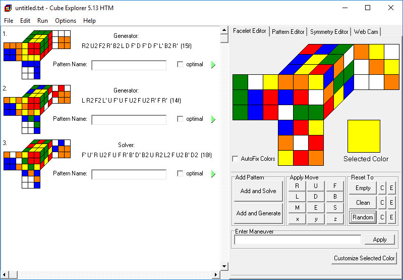

# Cube-Explorer

Cube Explorer developed over many years and in its current version 5.13 it is almost finished (concerning the functionality). It was developed with Delphi 6 - a software which does not run any more without problems on current Windows installations. To create a 64-bit program a complete redesign will be necessary.

Nevertheless I put the source code here for documentary purposes. I had to omit some third party files due to copyright issues though.

For more information on Cube Explorer, the mathematics behind the program and download of exe files visit the

## <a href="http://kociemba.org/cube.htm">Cube Explorer Homepage</a>
